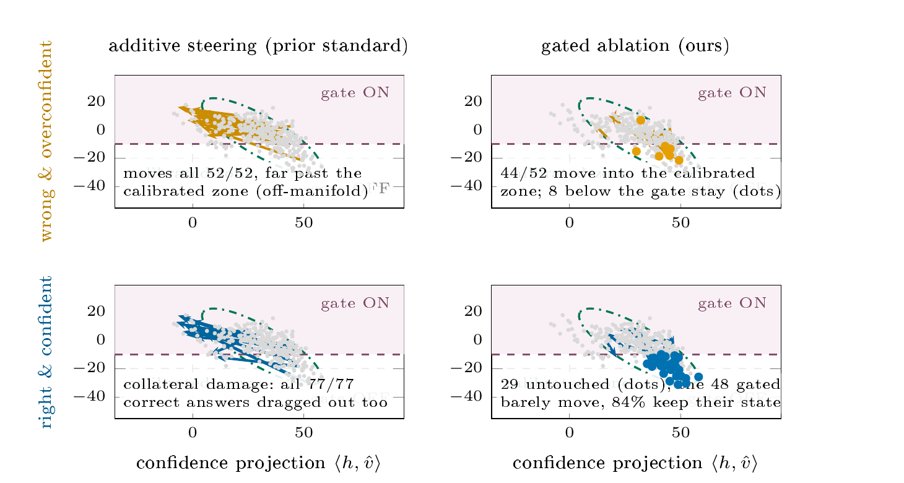
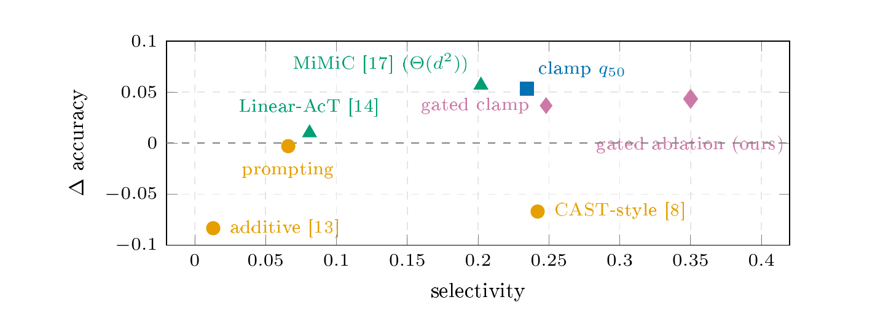

# Projection-Transport Steering

Minimal reproducibility package for **Projection-Transport Steering: Conditional Control of Reasoning Behavior in LLMs**.

- [Paper PDF](paper/paper.pdf)
- [LaTeX source](paper/paper.tex)
- [Reproducibility guide](REPRODUCIBILITY.md)

## Method

*Measured trace movement on the representative MMLU subset. Additive steering moves harmful and useful confidence together; gated ablation moves most overconfident-wrong traces toward the calibrated region while leaving part of the confident-right population untouched.*

## Results

Projection-Transport Steering separates two decisions that fixed-vector methods conflate: when the model should be changed and how its activations should move. Across five resampled MMLU subsets, gated ablation reaches **+0.266 selectivity with no detectable accuracy change**. The fixed additive edit is essentially nonselective and lowers accuracy, showing that stronger global steering is not a substitute for targeted control.

*Selectivity-accuracy trade-off on the representative MMLU subset; right and up are better. Gated ablation achieves the strongest observed selectivity without the accuracy loss of additive and CAST-style actions. The paragraph above reports the five-subset mean.*

The held-out confirmation reaches the same conclusion beyond Gemma. On OLMo-2/TruthfulQA, the detector-axis action improves calibrated truthfulness by **+0.137** over a norm-matched action, also improves correct-answer selection, and passes all seven predeclared construction controls.

The practical result is simple: detect whether intervention is warranted, then apply an input-dependent edit confined to the behavioral projection. Claims remain limited to the evaluated settings; the appendix and [archived rebuttal packet](https://github.com/mariklolik/projection-transport-steering/tree/archive/pr2-research-2026-10-04/rebuttal) preserve the full stress-test boundary.

## Repository map

| Path | Contents |
|---|---|
| general/steering.py | Projection, ablation, clamping, quantile transport, Gaussian transport, and Bures-Wasserstein operators |
| behaviour_specific/overconfidence/ | Core direction fitting, conditional steering, and paired evaluation |
| models_specific/ | Gemma-2B and Gemma-2-9B adapters |
| results/ | Record-analysis script; downloaded artifacts are ignored |
| behaviour_specific/overconfidence/directions/ | Downloaded fitted directions and projection statistics (ignored) |
| paper/ | Self-contained LaTeX source and compiled PDF |
| [Research archive](https://github.com/mariklolik/projection-transport-steering/tree/archive/pr2-research-2026-10-04/rebuttal) | Frozen protocols, audits, and post-review evidence |

## Quick verification

see [REPRODUCIBILITY.md](REPRODUCIBILITY.md).

## Main paper pipeline

    make artifacts
    make baseline
    make steer

The default commands reproduce the core Gemma confirmatory arm. The original five-subset pipeline (seeds 7, 11, 23, 31, and 47), additional behaviors, and full experiment grids remain in the [complete reproduction archive](https://github.com/mariklolik/projection-transport-steering/tree/archive/reproduction-full-2026-10-04). Greedy decoding is deterministic; those seeds resample questions rather than decoding noise.

## Artifact integrity

Key hashes and the exact reviewer-to-change mapping are recorded in the [archived manifest](https://github.com/mariklolik/projection-transport-steering/blob/archive/pr2-research-2026-10-04/rebuttal/manifest.json) and [review mapping](https://github.com/mariklolik/projection-transport-steering/blob/archive/pr2-research-2026-10-04/rebuttal/review.md). The public repository contains no model weights, credentials, caches, or private data.
